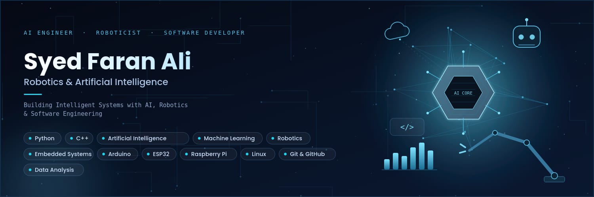

# 👋 Hi, I'm Syed Faran Ali

<h3 align="center">Robotics & Artificial Intelligence</h3>

Building Intelligent Systems with AI, Robotics & Software Engineering

---

## 🚀 About Me

I'm **Syed Faran Ali**, a passionate **Robotics & Artificial Intelligence** student at **The University of Lahore (UOL), Pakistan**.

I enjoy building intelligent software solutions that combine **Artificial Intelligence**, **Robotics**, **Embedded Systems**, and **Data Analytics**. My goal is to develop innovative technologies that solve real-world problems while continuously improving my technical skills.

Currently, I'm expanding my expertise through hands-on projects in:

- 🤖 Artificial Intelligence
- 🦾 Robotics
- 💻 Python Development
- ⚙️ Embedded Systems
- 📊 Data Analysis
- 🌐 Software Engineering

---

## 🎯 Current Focus

- 🤖 Artificial Intelligence
- 🦾 Robotics Engineering
- 🐍 Python Programming
- 📊 Data Analysis
- ⚡ Embedded Systems
- 🌐 Open Source Development
- 📚 Continuous Learning

---

## 💻 Tech Stack & Skills

### 👨‍💻 Programming Languages

  
  
  
  

### 🤖 Artificial Intelligence & Data Science

  
  
  
  

### 🦾 Robotics & Embedded Systems

  
  
  
  

### 🛠️ Software & Tools

  
  
  
  
  
  

### ☁️ Platforms

  
  

---

## 🚀 Featured Projects

### 🤖 AI Product Recommendation System
> **Python • Artificial Intelligence • Content-Based Filtering • Recommendation Engine**

An AI-powered recommendation system that analyzes user preferences and historical e-commerce data to generate personalized product recommendations using weighted similarity scoring.

🔗 **Repository:**  
https://github.com/Faran70177784/AI-Product-Recommendation-System

---

### 💬 Rule-Based AI Chatbot
> **Python • Artificial Intelligence • Natural Language Processing**

A rule-based conversational AI chatbot that responds to user queries using predefined logic and intelligent pattern matching.

🔗 **Repository:**  
https://github.com/Faran70177784/DecodeLabs-Internship

---

### 📊 Sports Intelligence Platform
> **Python • Streamlit • Data Analytics • AI Dashboard**

A professional sports analytics platform that provides interactive dashboards, KPI visualization, player analytics, and AI-driven insights using Streamlit.

🔗 **Repository:**  
https://github.com/Faran70177784/sports-intelligence-platform

---

### 🦾 Hand Gesture Controlled Robotic Arm
> **Arduino • ESP32 • NRF24L01 • MPU6050 • Embedded Systems**

Designed and developed a wireless robotic arm controlled through real-time hand gestures using motion sensors and RF communication.

---

### 💻 Arduino UNO R3 PCB Design
> **KiCad • PCB Design • Electronics**

Designed the complete schematic, PCB layout, and 3D model of the Arduino UNO R3 SMD development board using KiCad.

---
